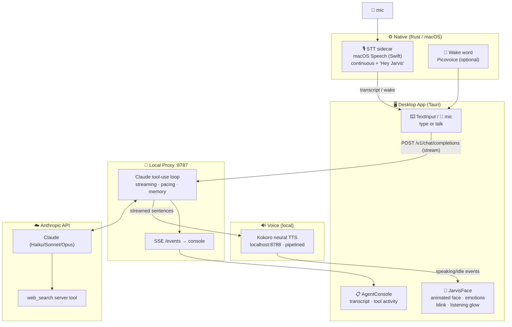

# Jarvis

A desktop AI agent with a face. **Claude is the brain** — it researches the web, reads and writes
files in a sandboxed workspace, and runs commands with your confirmation. An animated robotic face
with eye tracking is the interface: say **"Hey Jarvis"** to wake it, talk or type, and hear it speak
back in a natural local neural voice while its eyes track your face.



| Path | What it does |
|------|--------------|
| `proxy/` | **Agent runtime** — Claude's tool-use loop (web/files/commands), OpenAI-compatible streaming endpoint. Holds `ANTHROPIC_API_KEY`. |
| `proxy/evals/` | **Autonomous behavior evals** (`npm run evals`) — e.g. real-time pacing, graded structurally + LLM-judge. |
| `tts/` | **Local Kokoro neural-TTS** server (`server.py`) + `setup.sh` / `start.sh`. |
| `frontend/` | React + Tauri desktop app: the face, voice I/O, agent console. |
| `frontend/src-tauri/` | Rust: wake word (Picovoice), STT sidecar (macOS Speech), tray, window. |

## Quickstart (macOS — Apple Silicon or Intel)

**Prerequisites:** Node 22+, Python 3.11+, Rust (`curl --proto '=https' --tlsv1.2 -sSf https://sh.rustup.rs | sh`), Xcode Command Line Tools. An **Anthropic API key**. macOS **Dictation** enabled (System Settings → Keyboard → Dictation) for voice input.

```bash
# 1. Configure
cp .env.example .env          # fill in ANTHROPIC_API_KEY + PROXY_API_KEY (= VITE_PROXY_API_KEY)

# 2. Install
cd proxy && npm install && cd ..
cd frontend && npm install && cd ..
./tts/setup.sh                # Kokoro venv + model (~340MB, one time)
./scripts/build-sidecar.sh    # compile the Swift sidecars for this arch

# 3. Run (three local services)
cd proxy && npm start                         # terminal 1 — Claude proxy :8787
./tts/start.sh                                # terminal 2 — Kokoro voice :8788
cd frontend && set -a && . ../.env && set +a \
  && npm run tauri:dev:voice                  # terminal 3 — the app (wake-word + voice-input)
```

Then say **"Hey Jarvis, …"** or type in the box. Feature flags: `tauri:dev` (face only) · `tauri:dev:wake` (+ wake word) · `tauri:dev:voice` (+ speech-to-text).

## Voice

- **Speech-to-text** — a macOS Speech-framework Swift sidecar (`src-tauri/sidecar/jarvus-stt.swift`) listens continuously and detects "Hey Jarvis" in the transcript. Requires Dictation enabled. The 🎤 button toggles the mic.
- **Text-to-speech** — local **Kokoro-82M** neural voice (Apache-2.0, offline). The server pipelines synthesis so streamed sentences play gaplessly; the agent's reply is spoken sentence-by-sentence so its pacing line ("On it, one sec…") is heard immediately. Voice via `JARVUS_TTS_VOICE` (default `am_adam`; e.g. `bm_george` British, `af_sarah` female). Falls back to the system voice if the server is off.
- **Wake word** — optional Picovoice "Jarvis" (set `PICOVOICE_ACCESS_KEY`). The built-in "Jarvis" keyword needs no training; transcript-based "Hey Jarvis" works without a key.
- **Interrupt** — press **Esc**, **click Jarvis**, or (on headphones) just talk over him. Hardware echo cancellation (`setVoiceProcessingEnabled`) is gated behind `JARVUS_AEC=1` — it works on Apple Silicon but not on Intel (forces an unsupported audio format); use Esc/click on speakers.

## What the agent can do

| Tool | Type | Notes |
|------|------|-------|
| `web_search` | Anthropic **server tool** | Real-time research + citations. Enable "Web search" for your org in the Anthropic Console. |
| `list_dir`, `read_file`, `search_files` | local | Read-only, auto-execute. |
| `write_file`, `edit_file` | local | **Mutating** — require spoken/explicit confirmation (`user_confirmed=true`). |
| `run_command` | local | **Off by default** (`AGENT_ENABLE_COMMANDS`). Confirmed + denylisted + workspace-cwd. |
| `memory_*` | managed | Long-term memory across conversations (`AGENT_ENABLE_MEMORY`). |
| `show_media` | display | Pushes an image/link to the **Agent Console** (doesn't speak it). |

Everything is sandboxed to `AGENT_WORKSPACE` (default `proxy/workspace`); mutating actions append to `workspace/.agent-audit.log`. The agent console (right panel) subscribes to the proxy's `GET /events` SSE for transcript, tool activity, citations, and media.

## Testing

```bash
cd frontend && npm test       # vitest — voiceOutput, chatSession, speechChunker, bargeIn
cd proxy && npm test          # node --test — OpenAI↔Anthropic translate, agent, conversation
cd proxy && npm run evals     # autonomous agent behavior evals (real Claude calls)
```

## Troubleshooting

- **Voice input does nothing / "Siri and Dictation are disabled"** — enable **Dictation** (System Settings → Keyboard → Dictation); it also downloads the on-device model.
- **Typed messages get no reply (proxy 401)** — `VITE_PROXY_API_KEY` must equal `PROXY_API_KEY`.
- **No voice, only the system robot voice** — the Kokoro server isn't running; `./tts/start.sh`.
- **`web_search` errors** — enable "Web search" for your org in the Anthropic Console (Settings → Privacy).
- **Wake word inactive** — set a free `PICOVOICE_ACCESS_KEY` (https://console.picovoice.ai) and run `tauri:dev:wake`/`:voice`.
- **Camera/mic permission in dev** — `tauri dev` runs a bare binary; if a prompt doesn't appear, build the packaged `.app` (`npm run tauri:build:voice`) so the `Info.plist` usage strings apply.

See **`AGENTS.md`** for the condensed contributor rules, and `docs/superpowers/` for the design spec and plan.
